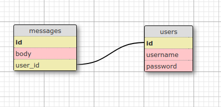

# Chat App
## Objectives
**1.** [Learn the basics of Action Cable](https://guides.rubyonrails.org) which integrates WebSockets with the rest of your Rails application.

**2.** [Learn the basics of Semantic](https://semantic-ui.com/introduction/getting-started.html) - UI framework designed for theming


## User Stories


1. As a User I can sign in
2. As a User I can sign out
3. As a User I can send a message to a chatroom
4. As a User I can read messages from the chatroom


## To get started
```bash
$ bundle install
$ yarn install
$ rails db:create db:migrate db:seed
$ rails s
```
## To create your own user
```ruby
# seeds.rb
User.create!(username: 'type_a_username', password: 'type_a_password')
```

## Gems Installed
* [autoprefixer\-rails](https://github.com/ai/autoprefixer-rails) - Parse CSS and add vendor prefixes to CSS rules using values from the [Can I Use](https://caniuse.com/) website.

* [jquery-rails](https://github.com/rails/jquery-rails) - A gem to automate using jQuery with Rails

* [semantic-ui-sass](https://github.com/doabit/semantic-ui-sass) - Semantic UI, converted to Sass and ready to drop into Rails, Compass, or Sprockets.

* [bcrypt](https://github.com/codahale/bcrypt-ruby) - The bcrypt Ruby gem provides a simple wrapper for safely handling passwords.

* [pry-rails](https://github.com/rweng/pry-rails) - Use Pry as your rails console

## If I were to deploy, I would at least
* Install [devise](https://github.com/heartcombo/devise)
* Install [pundit](https://github.com/varvet/pundit)
* Make it fully responsive
