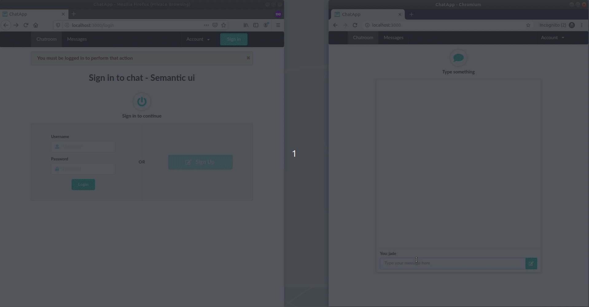

# Chat App



[Download the project](https://github.com/rom-30/chat_app/archive/master.zip) or clone it

```bash
$ git clone git@github.com:rom-30/chat_app.git
```

## Objectives
**1.** [Learn the basics of Action Cable](https://guides.rubyonrails.org) which integrates WebSockets with the rest of your Rails application.

**2.** [Learn the basics of Semantic](https://semantic-ui.com/introduction/getting-started.html) - UI framework designed for theming


## User Stories


1. As a User I can sign in
2. As a User I can sign out
3. As a User I can send a message to a chatroom
4. As a User I can read messages from the chatroom


## To get started
```bash
$ bundle install
$ yarn install
$ rails db:create db:migrate db:seed
$ rails s
```
## Info
* Rails: 6.0.1
* Ruby: 2.6.3

## To create your own user
```ruby
# seeds.rb or rails c
User.create!(username: 'type_a_username', password: 'type_a_password')
```

## :warning: Session Controller Implemented without devise

```ruby
# applications_controller.rb
class ApplicationController < ActionController::Base
  helper_method :current_user, :logged_in?

  def current_user
    @current_user ||= User.find(session[:user_id]) if session[:user_id]
  end

  def logged_in?
    !current_user.nil?
  end

  def require_user
    unless logged_in?
      flash[:error] = 'You must be logged in to perform that action'
      redirect_to login_path
    end
  end
end


# sessions_controller.rb
class SessionsController < ApplicationController
  before_action :redirect_if_logged_in, only: %i[new create]

  def new; end

  def create
    user = User.find_by(username: params[:session][:username])

    if user&.authenticate(params[:session][:password])
      session[:user_id] = user.id
      flash[:success] = "You have successfully signed in"
      redirect_to root_path
    else
      flash.now[:error] = "Try again but this time with the correct credentials okay!!!"
      render :new
    end
  end

  def destroy
    session[:user_id] = nil
    flash[:success] = "You have successfully signed out"

    redirect_to login_path
  end

  private

  def redirect_if_logged_in
    if logged_in?
      flash[:error] = "You are already logged in"
      redirect_to root_path
    end
  end
end

``` 
## Chat Room Channel Js
```js
import consumer from "./consumer"

consumer.subscriptions.create("ChatRoomChannel", {
  connected() {
    // Called when the subscription is ready for use on the server
  },

  disconnected() {
    // Called when the subscription has been terminated by the server
  },

  received(data) {
    // Called when there's incoming data on the websocket for this channel
    $('#message-container').append(data.content)

    const scrollToBottom = () => {
      if ($('#messages').length > 0) {
        $('#messages').scrollTop($('#messages')[0].scrollHeight);
      }
    }
    scrollToBottom()

    // To clear input
    const input = document.querySelector('#message_body');
    input.value = "";
  }
});

```

## Gems Installed
* [autoprefixer\-rails](https://github.com/ai/autoprefixer-rails) - Parse CSS and add vendor prefixes to CSS rules using values from the [Can I Use](https://caniuse.com/) website.

* [jquery-rails](https://github.com/rails/jquery-rails) - A gem to automate using jQuery with Rails

* [semantic-ui-sass](https://github.com/doabit/semantic-ui-sass) - Semantic UI, converted to Sass and ready to drop into Rails, Compass, or Sprockets.

* [bcrypt](https://github.com/codahale/bcrypt-ruby) - The bcrypt Ruby gem provides a simple wrapper for safely handling passwords.

* [pry-rails](https://github.com/rweng/pry-rails) - Use Pry as your rails console

## If I were to deploy, I would at least
* Install [devise](https://github.com/heartcombo/devise)
* Install [pundit](https://github.com/varvet/pundit)
* Make it fully responsive
